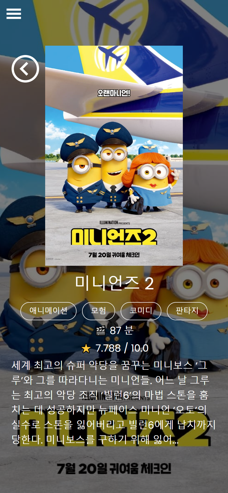

# :movie_camera: HYEONCINEMA : 영화 웹 서비스

---

# :hammer: Using

     

---

# 💻 Responsive

## 1. pc

## 2. tablet

## 3. mobile

---

# :open_file_folder: 각 페이지 별 기능

## 1. Home Page

(1) Navbar

- ① Home으로 이동 할 수 있는 로고
- ② 클릭시 각 페이지로 이동(상영중인 영화, 인기 영화, 영화 평점순, 상영예정작)
- ③ 클릭시 회원가입과 로그인form modal 팝업
- ④ window.scrollY가 50이상일 경우 배경색이 검정색이 되도록 만듦

(2) MainSlider

- ① react swiper를 사용하여 현재 상영중인 영화 6편을 slider로 만듦
- ② axios를 사용하여 The Movie Database(TMDB)사이트의 API를 가져와서 slide에 넣어줌

(3) TopRatedSlider, UpComingSlider

- ① react swiper를 사용하여 영화 평점순, 상영예정작인 영화 20편을 slider로 만듦
- ② 영화 포스터를 hover시 영화제목과 평점이 나오며 클릭하면 해당 영화의 상세 페이지로 이동

---

## 2. Detail Page

- Detail Page도 반응형으로 제작 (크기에 따른 글자수 크기 제한)
- 뒤로가기 버튼

### 1. pc

### 2. tablet

### 3. mobile

---

## 3. 상영중인 영화 / 인기 영화 / 영화 평점순 / 상영예정작

- 상영중인 영화를 클릭했을 경우

## 👩‍💻 추가해야 될 것

- 각 메뉴 페이지의 Pagination 추가

---
